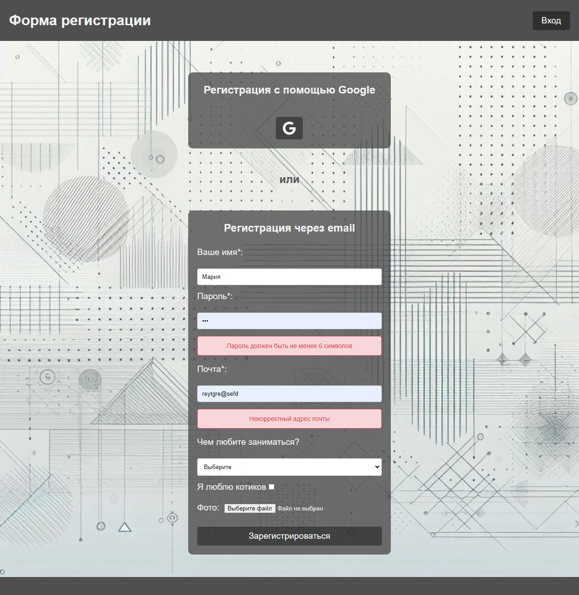
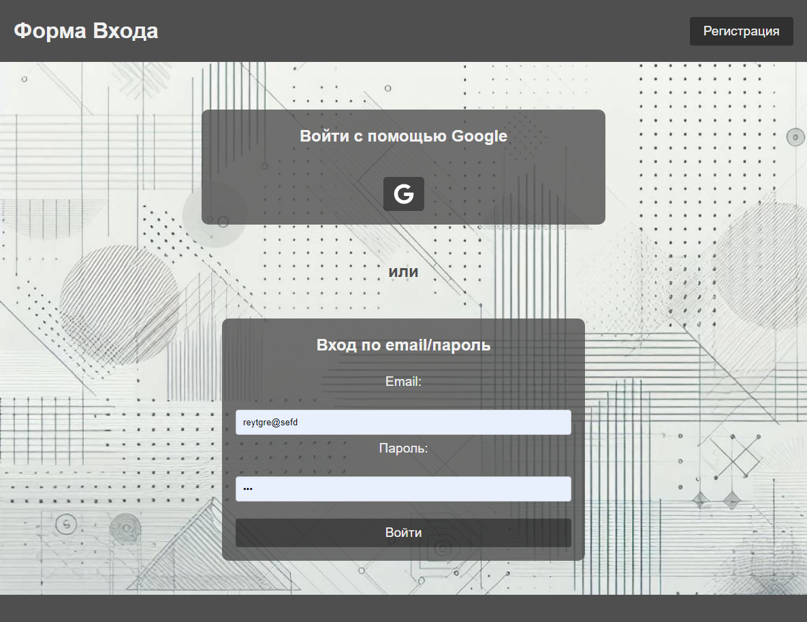
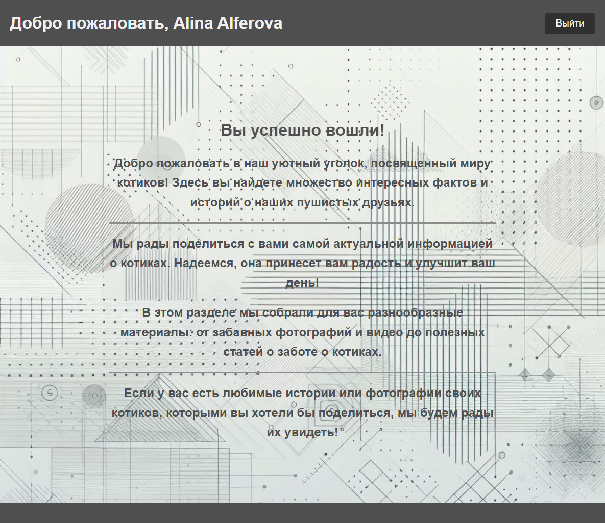

# [Authentication](https://asalferova.github.io/Authentication/ "Ссылка на сайт")

# Содержание

1. <a href="#description">Описание проекта</a>
2. <a href="#setup">Настройка проекта</a>
3. <a href="#stack">Технологии</a>
4. <a href="#screenshots">Скриншоты сайта</a>
   


<h2 id="description">Описание проекта</h2>

Веб-приложение аутентификации пользователя firebase API.

  * Приложение использует vue-router для создания маршрутов, есть три маршрута: домашняя страница, страница регистрации и страница входа.
  Для каждого маршрута установлены метаданные auth, которые определяют, требуется ли аутентификация для доступа к этому маршруту.

  * Pinia для управления состоянием приложения.
       Хранилище содержит методы для аутентификации пользователя с помощью электронной почты и пароля или через Google.
       При регистрации по электронной почте и паролю используется метод axios.post, который отправляет запрос на сервер Firebase с электронной почтой и паролем пользователя.
       При регистрации через Google используется метод signInWithPopup из библиотеки Firebase, который открывает всплывающее окно для входа через Google.
    
   * Главный компонент App.vue использует RouterView для отображения компонентов. При загрузке приложения он проверяет, есть ли токены пользователя в localStorage, и если есть, устанавливает их в хранилище auth.
     
   * Файл api.js настраивает экземпляр axios для выполнения HTTP-запросов.
   Он также настраивает перехватчики запросов и ответов для добавления токена аутентификации к запросам и обработки ошибок аутентификации,
   перехватчик ответа axios автоматически обновляет токены, если сервер возвращает ошибку 401.

   * Проект использует vite в качестве сборщика.
     
   * Реализована валидация как на сервере (обработка ошибок с сервера), так и на клиенте (валидация формы vuelidate).

Пользователи, которые не прошли аутентификацию, не смогут просматривать домашнюю страницу.
Проект адаптирован под все экраны.


<h2 id="setup">Настройка проекта</h2>

### Установка
```
npm install
```

### Компилирует и выполняет перезагрузку для разработки
```
npm run dev
```

### Компилирует и минимизирует для продакшн
```
npm run build
```

### Проверка и исправление файлов
```
npm run lint
```

### Настройка конфигурации
[Vite Configuration Reference](https://vitejs.dev/config/).


<h2 id="stack">Технологии</h2>

   * Vue3 Composition API
   * Vite
   * Vue Router
   * Pinia
   * FireBase
   * axios
   * Vuelidate
   * eslint, prettier

<h2 id="screenshots">Скриншоты сайта</h2>

1. Скриншот страницы регистрации



2. Скриншот страницы входа



3. Скриншот главной страницы
 



